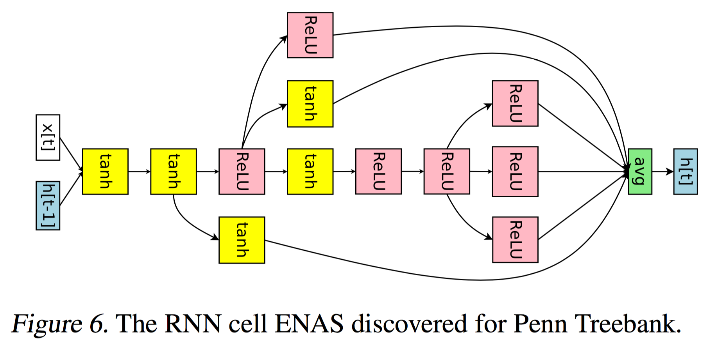
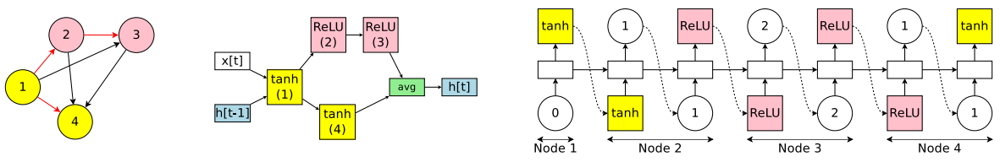
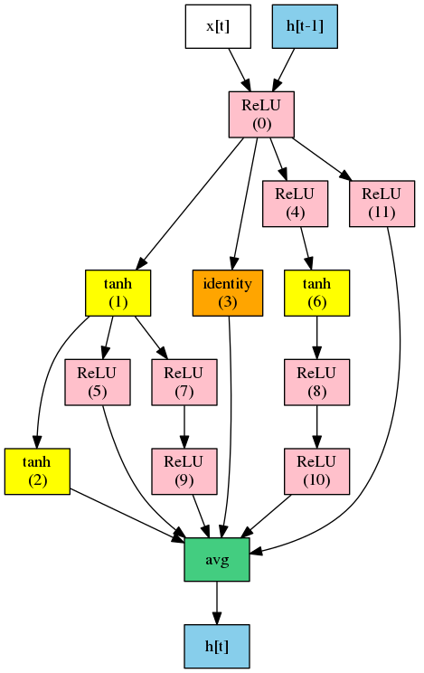
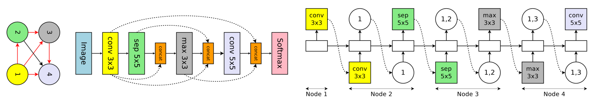

# Efficient Neural Architecture Search (ENAS) in PyTorch

PyTorch implementation of [Efficient Neural Architecture Search via Parameters Sharing](https://arxiv.org/abs/1802.03268).

**ENAS** reduce the computational requirement (GPU-hours) of [Neural Architecture Search](https://arxiv.org/abs/1611.01578) (**NAS**) by 1000x via parameter sharing between models that are subgraphs within a large computational graph. SOTA on `Penn Treebank` language modeling.

**\*\*[Caveat] Use official code from the authors: [link](https://github.com/melodyguan/enas)\*\***

## Prerequisites

- Python 3.6+
- [PyTorch==0.3.1](https://pytorch.org/get-started/previous-versions/)
- tqdm, scipy, imageio, graphviz, tensorboardX

## Usage

Install prerequisites with:

    conda install graphviz
    pip install -r requirements.txt

To train **ENAS** to discover a recurrent cell for RNN:

    python main.py --network_type rnn --dataset ptb --controller_optim adam --controller_lr 0.00035 \
                   --shared_optim sgd --shared_lr 20.0 --entropy_coeff 0.0001

    python main.py --network_type rnn --dataset wikitext

To train **ENAS** to discover CNN architecture (in progress):

    python main.py --network_type cnn --dataset cifar --controller_optim momentum --controller_lr_cosine=True \
                   --controller_lr_max 0.05 --controller_lr_min 0.0001 --entropy_coeff 0.1

or you can use your own dataset by placing images like:

    data
    ├── YOUR_TEXT_DATASET
    │   ├── test.txt
    │   ├── train.txt
    │   └── valid.txt
    ├── YOUR_IMAGE_DATASET
    │   ├── test
    │   │   ├── xxx.jpg (name doesn't matter)
    │   │   ├── yyy.jpg (name doesn't matter)
    │   │   └── ...
    │   ├── train
    │   │   ├── xxx.jpg
    │   │   └── ...
    │   └── valid
    │       ├── xxx.jpg
    │       └── ...
    ├── image.py
    └── text.py

To generate `gif` image of generated samples:

    python generate_gif.py --model_name=ptb_2018-02-15_11-20-02 --output=sample.gif

More configurations can be found [here](config.py).

## Results

Efficient Neural Architecture Search (**ENAS**) is composed of two sets of learnable parameters, controller LSTM *θ* and the shared parameters *ω*. These two parameters are alternatively trained and only trained controller is used to derive novel architectures.

### 1. Discovering Recurrent Cells

Controller LSTM decide 1) what activation function to use and 2) which previous node to connect.

The RNN cell **ENAS** discovered for `Penn Treebank` and `WikiText-2` dataset:

 

Best discovered ENAS cell for `Penn Treebank` at epoch 27:

You can see the details of training (e.g. `reward`, `entropy`, `loss`) with:

    tensorboard --logdir=logs --port=6006

### 2. Discovering Convolutional Neural Networks

Controller LSTM samples 1) what computation operation to use and 2) which previous node to connect.

The CNN network **ENAS** discovered for `CIFAR-10` dataset:

(in progress)

### 3. Designing Convolutional Cells

(in progress)

## Reference

- [Neural Architecture Search with Reinforcement Learning](https://arxiv.org/abs/1611.01578)
- [Neural Optimizer Search with Reinforcement Learning](https://arxiv.org/abs/1709.07417)

## Author

Taehoon Kim / [@carpedm20](http://carpedm20.github.io/)
